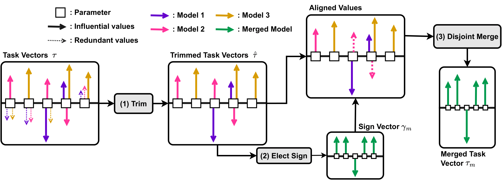

# Resolving Interference When Merging Models

* Authors: [Prateek Yadav](https://prateek-yadav.github.io/), [Derek Tam](https://dptam.github.io/), [Leshem Choshen](https://ktilana.wixsite.com/leshem-choshen), [Colin Raffel](https://colinraffel.com/), and [Mohit Bansal](https://www.cs.unc.edu/~mbansal/)
* Paper: [arXiv](https://arxiv.org/abs/2306.01708)




# Merging Models

## Setup

1. Create a virtual environment and activate it.
```
python3 -m venv env
source env/bin/activate
```
2. Install dependencies
```
python -m pip install -r requirements.txt -f https://download.pytorch.org/whl/cu113/torch_stable.html
```

3. Download Story Cloze Dataset and update its path in data/dataset_readers.py StoryClozeReader class.

4. Set the path to where finetuned models are stored in utils/merge_utils.py

## Evaluation

### Evaluate IA3 across multiple prompts and report median.

```
$path_to_checkpoint = # path to your checkpoint
$eval_split = validation
$dataset = rte

python ./src/inference.py -c configs/ia3_base.json --multiple_prompts -i ${dataset} --kwargs checkpoint_to_directly_load_model=${path_to_checkpoint} split=${eval_split} project_name=ia3 experiment_name=${dataset}
```

### Evaluate T5-Large.

```
$path_to_checkpoint = # path to your checkpoint
$eval_split = validation
$dataset = rte

python ./src/inference.py -c configs/t5_large.json -i ${dataset} --kwargs checkpoint_to_directly_load_model=${path_to_checkpoint} split=${eval_split} project_name=t5-large experiment_name=${dataset}
```


## Merging Models

### T5-Large

#### Basic Averaging
```
$eval_split = validation

python ./src/ties_merging.py -c configs/t5_large.json -i t5_mixture -m t5_mixture -f basic_mean --kwargs split=${eval_split} project_name=t5-large experiment_name=mean
```

#### Task Vectors
```
$eval_split = validation
$eval_function = task-vector_linear+0.1+1.01+0.1

python ./src/ties_merging.py -c configs/t5_large.json -i t5_mixture -m t5_mixture -f ${eval_function} --kwargs split=${eval_split} project_name=t5-large experiment_name=task_vectors
```
Performs merging for different values of lambda. will try out all lambda values between 0 and 1 in incrementso of 0.1.

#### TIES MERGING
```
$eval_split = validation
$redundant = topk20
$elect = mass
$agg = dis-mean
$scale = linear+0.8+2.51+0.1

python ./src/ties_merging.py -c configs/t5_large.json -i t5_mixture -m t5_mixture -f ${redundant}_${elect}_${agg}_${scale} --kwargs split=${eval_split} project_name=t5-large experiment_name=ties
```


### IA3

#### Basic Averaging
```
$eval_split = validation

python ./src/ties_merging.py -c configs/ia3_base.json -i T0_held_out -m T0_held_out -f basic_mean --multiple_prompts --kwargs pretrained_model=bigscience/T0_3B split=${eval_split} project_name=ia3 experiment_name=mean
```

#### Task Vectors
```
$eval_split = validation
$eval_function = task-vector_linear+0.1+1.01+0.1

python ./src/ties_merging.py -c configs/ia3_base.json -i T0_held_out -m T0_held_out -f ${eval_function} --multiple_prompts --kwargs pretrained_model=bigscience/T0_3B split=${eval_split} project_name=ia3 experiment_name=task_vectors
```

#### TIES MERGING
```
$eval_split = validation
$redundant = topk20
$elect = mass
$agg = dis-mean
$scale = linear+0.8+2.51+0.1

python ./src/ties_merging.py -c configs/ia3_base.json -i T0_held_out -m T0_held_out -f ${redundant}_${elect}_${agg}_${scale} --multiple_prompts --kwargs pretrained_model=bigscience/T0_3B split=${eval_split} project_name=ia3 experiment_name=ties
```

# Reference
Please cite our paper if you use our models in your works:


```bibtex
@article{yadav2023resolving,
      title={Resolving Interference When Merging Models}, 
      author={Prateek Yadav and Derek Tam and Leshem Choshen and Colin Raffel and Mohit Bansal},
      year={2023},
      journal={arXiv preprint arXiv:2306.01708},
}
